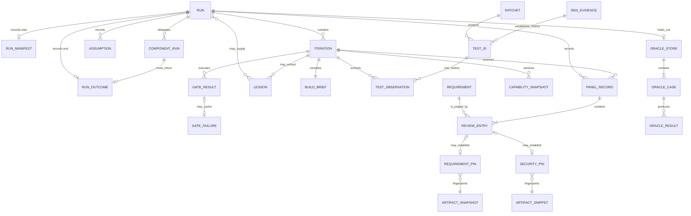
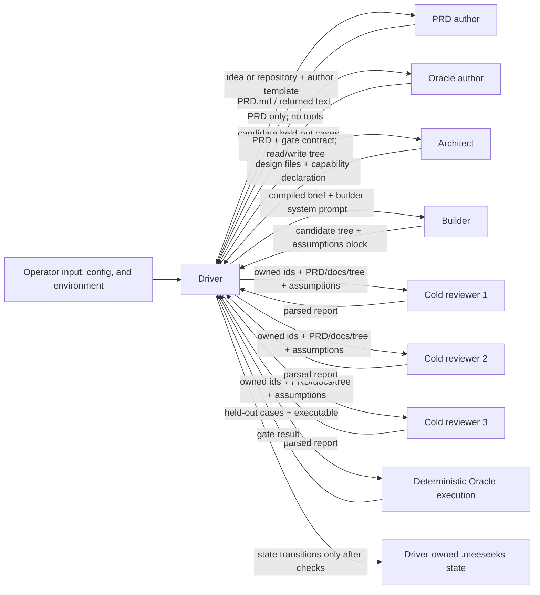

# Dynamic workflows and durable provenance

Status: supporting architecture analysis and experiment design; non-normative, with no runtime
implementation yet.

Last researched: 2026-08-17 against Claude Code documentation current on that date.

This note evaluates two related ideas:

1. letting a durable Meeseeks role use a Claude Code dynamic workflow as a disposable
   internal execution harness; and
2. adding explicit dependency and provenance metadata so Meeseeks can explain and
   selectively invalidate conclusions.

`DESIGN.md` remains the product specification. This architecture note records source-backed
analysis, trade-offs, proposed boundaries, and experiments behind any future specification
change. Raw research remains under `docs/research/`.

## Decision summary

- **Dynamic workflows: experiment first, then adopt only inside a role.** The initial experiment
  is Builder-only. A later independently instantiated reviewer or Oracle-author may use a bounded
  workflow only if its cold/safe-mode boundary can be preserved through a documented, measured
  selective invocation. No workflow owns global state, ratchets, review coverage, budgets, or
  terminal status.
- **Driver: never a workflow.** The Node driver remains the durable control plane and the
  only authority allowed to advance global state or declare `SHIPPED`.
- **Panel: ordinary safe-mode processes in the initial experiment, never one shared workflow.**
  If reviewers eventually use workflows, each cold reviewer keeps its own top-level `claude -p`
  process and receives only one selectively supplied private workflow.
- **Oracle execution: never a workflow.** Model-assisted Oracle authoring may be explored
  later; accepted Oracle cases continue to execute deterministically.
- **General execution graph: rejected.** The ratchet, pins, gate records, review ownership,
  and component outcomes already encode most useful graph semantics with stronger,
  purpose-built invariants.
- **Minimal provenance metadata: conditionally useful.** Add dependency metadata to
  existing records before considering a separate claim DAG. A graph earns implementation
  only if real runs show stale evidence or unnecessarily broad rework that current
  structures cannot address.
- **Reliability prerequisites come first.** PLAN Gate 0 and item 77 must close, and item 84 must
  record the actual containment outcome, before one `claude -p` child may fan out into many agents.
- **Verified Research: adopt first as a job type, independently of workflow adoption.** Item 34 may
  use item 49's artifact substrate without dynamic fan-out; a workflow inside Researcher is a later
  optimization and never its factuality verdict.
- **Verified Red Team: park behind containment and incremental-value evidence.** Item 86 is a scoped
  assessment producer, not a new authority. It enters implementation only if a benign pilot shows
  reproducible findings beyond the existing Panel/security path.

The success measure is morning user acceptance: the user returns to work that satisfies
the original intent without substantive repair. Agent count, token count, and raw speed are
diagnostics, not product outcomes.

## Current Meeseeks mechanisms that must remain

Meeseeks already has an implicit durable graph:

| Durable relation | Current mechanism |
|---|---|
| test passed in history | monotonic passing-ID ratchet |
| requirement passed on cited evidence | requirement pin plus evidence-file fingerprint |
| security protection remains present | security pin plus snippet/fingerprint and scoped escalation |
| test can earn ratchet credit | red-evidence proof |
| reviewer is responsible for requirement IDs | explicit Panel ownership and union validation |
| final tree has independent review | mandatory full cold Panel before `SHIPPED` |
| child component claims completion | child outcome followed by parent merge, gates, and Panel |
| previous gate failure remains applicable | byte-identical negative gate cache |
| Builder assumption is reviewable | driver-owned assumption ledger with citations |

A new abstraction must not replace these mechanisms merely because they can be drawn as a
graph. In particular:

- test IDs remain monotonic;
- quarantine remains a shipping blocker;
- carried requirements remain only a failed-iteration pre-filter;
- the final full Panel remains mandatory;
- model output never becomes deterministic evidence by declaration; and
- child `SHIPPED` remains a parent pre-filter, not inherited terminal authority.

### Conceptual entity/relationship diagram

This diagram is a review aid, not a storage schema. `RUN` and `ITERATION` are conceptual entities
assembled from several files; the current implementation does not assign every entity a stable id
or persist every edge. That missing identity is exactly why minimal provenance metadata is a
conditional proposal below. Relationships describe current product semantics; the constraint audit
below identifies where cardinality, identity, or persistence is not yet enforced. None grants
permission for a graph layer to replace the existing stores.



The diagram exposes six current limits rather than hiding them:

- `RUN` has no stable run id shared by all records; archive co-location and iteration numbers do
  most of that work today.
- a `REVIEW_ENTRY` has a textual `file:line`, while the durable requirement pin fingerprints the
  whole file; the line is a locator, not durable identity;
- assumptions have citations but no accepted dependency edges to the requirements, artifacts, or
  evidence that used them; and
- gate results and test reports are mostly iteration-transient, while the ratchet, red evidence,
  and negative gate cache retain only the relations their invariants require;
- lessons are cross-run advisory records: an iteration may extract one and later runs may receive
  it, so a lesson is not owned by exactly one run; and
- the diagram shows the intended run-to-Oracle relationship, but the current implementation leaves
  `oracle.json` in place across runs and does not bind it to the current PRD. `REVIEW.md` F8 is the
  release-blocking lifecycle defect; the ERD is not evidence that the relationship is enforced.

### ERD constraint audit

| Relationship or entity | Current implementation | Constraint status |
|---|---|---|
| `RUN -> RUN_MANIFEST` | one atomic manifest exists only after design and before the main loop | pre-loop runs have no manifest/receipt; F10 defines the missing durable run boundary |
| `RUN -> RUN_OUTCOME` | `driveRun.finish` writes one outcome, while earlier and outer failures bypass it | optional in practice and non-atomic; F10 |
| `RUN -> ORACLE_STORE` | one unversioned `oracle.json` may survive multiple runs/specifications | intended one-to-zero-or-one cardinality is not enforced; F8/F12 |
| `RUN <-> LESSON` | lessons persist across runs; an iteration produces them and later briefs may consume them | many-to-many use with missing stable source/consumer run ids; advisory only |
| `ITERATION -> GATE_RESULT` | gate results exist in memory; only selected failures enter `gate-skip.json` | runtime cardinality exists, durable passing provenance does not; F22 |
| `ITERATION -> TEST_OBSERVATION` | reused report files are parsed into name-based IDs | attempt/tree/path/definition identity is incomplete; F16/F17/F20 |
| `PANEL_RECORD -> REVIEW_ENTRY` | required ownership/cardinality is checked before and after review | enforced for IDs, but evidence and exact-tree identity remain F6/F14 |
| `REVIEW_ENTRY -> REQUIREMENT_PIN` | a passing cited entry may establish a whole-file fingerprint | carry is a pre-filter only; current definition/source constraints remain F6/F12 |
| `COMPONENT_RUN -> RUN_OUTCOME` | the parent requires a readable child outcome before merge | child terminal authority is correctly a parent pre-filter, never inherited shipping authority |
| `RUN -> acceptance proof` | outcome, Panel, ratchet, Oracle, deploy, and gates have no shared immutable receipt | relation is absent rather than a graph-storage request; F22/item 76 is the minimal repair |

This audit does not justify a graph database or general claim DAG. The concrete repairs are stable
run/spec/tree/attempt identities and receipts added to the stores that already own the decisions.
A future shadow DAG remains conditional on PLAN item 55's measured admission test.

## Claude Code dynamic workflows: documented behavior

Primary sources:

- <https://code.claude.com/docs/en/workflows>
- <https://code.claude.com/docs/en/cli-reference>
- <https://code.claude.com/docs/en/env-vars>
- <https://code.claude.com/docs/en/agent-sdk/slash-commands>
- <https://code.claude.com/docs/en/agent-sdk/plugins>
- <https://code.claude.com/docs/en/agent-sdk/subagents>
- <https://code.claude.com/docs/en/agent-sdk/hooks>
- <https://code.claude.com/docs/en/agent-sdk/cost-tracking>
- <https://code.claude.com/docs/en/agent-sdk/typescript>
- <https://code.claude.com/docs/en/worktrees>

The following statements are documented behavior, not Meeseeks assumptions:

- A dynamic workflow is a JavaScript script executed by a workflow runtime. The script
  coordinates subagents while intermediate results remain in script variables.
- The workflow script itself has no direct filesystem or shell access and cannot load modules;
  agents perform reads, writes, and commands. This narrows the script's authority but does not
  narrow the agents' inherited permissions.
- Workflows require Claude Code 2.1.154 or later. That is one feature minimum, not Meeseeks'
  product-wide compatibility policy: other mandatory flags and boundaries may require a newer
  release, while a greater release can also change another contract. PLAN item 83 must admit each
  boundary through the complete pinned live suite and keep one CLI identity across a run.
- Saved workflows live under project or user `.claude/workflows/` directories, or may be
  distributed by a plugin and invoked as a namespaced slash command.
- Claude Code currently bundles `/deep-research`, which fans out source gathering, cross-checks
  claims, filters claims that fail its internal vote, and labels claims it cannot verify. Those are
  useful producer behaviors, not deterministic proof that a surviving claim is true.
- Slash commands can be sent programmatically through the Agent SDK; supported commands
  are reported in the initialization message.
- Workflows are available in `claude -p` and the Agent SDK, and launch without an
  interactive approval prompt there. The CLI's `--safe-mode` disables workflow loading along
  with other customizations, so availability in print mode does not imply availability to a cold
  Meeseeks role.
- The natural-language/`ultracode` opt-in is accepted only from direct human-origin input.
  A synthesized `-p` prompt, scheduled prompt, webhook, or ordinary non-human SDK message
  does not cause ad-hoc workflow generation.
- A stopped agent or unrecoverable API failure can resolve to `null`. Meeseeks must retain
  expected cardinality and fail the bounded assignment when any required result is absent;
  filtering falsey results would violate the fail-closed invariant.
- The runtime permits up to 16 concurrent agents and 1,000 agents total. Workflow size
  settings are advice, not caps. Large-run warnings are advisory.
- Workflow agents use the session model unless a stage routes elsewhere or an environment
  override applies. Organization policy may substitute another model.
- Workflow agents run in `acceptEdits` and inherit session permissions. Permission prompts
  cannot be answered during unattended `-p` execution.
- A paused workflow reuses some completed-agent results only within the same Claude Code
  session. Exiting and starting another session starts the workflow again.
- In `-p`, `CLAUDE_CODE_PRINT_BG_WAIT_CEILING_MS` bounds how long Claude waits after the final
  turn for background workflows whose result belongs in the output. The documented default is
  600,000 ms; exceeding it terminates remaining background work, while `0` waits indefinitely.
  This is a post-turn timer, not an absolute role deadline.
- Current CLI documentation says `--max-budget-usd` includes subagent spend; on releases with the
  v2.1.217 cap-enforcement behavior, reaching the cap prevents another subagent spawn and stops
  remaining background subagents. Dynamic workflows coordinate subagents, but Meeseeks must live-prove
  that workflow agents follow this contract through its exact pinned `claude -p` path.
- Matching agents in one workflow may share a cached tools-and-system-prompt prefix; this mechanism
  does not share their intermediate results. Cache reuse is a cost behavior, not proof of durable
  role independence, which still requires separate top-level processes and supplied contexts.
- Workflow run scripts are written under Claude's session storage. That storage is not
  Meeseeks durable state.

The 16-concurrent and 1,000-total values are platform maxima, not a Meeseeks safety policy.
Any experiment must impose a lower Driver-owned aggregate descendant ceiling across all role
workflows in the run and refuse closed when that ceiling is exhausted.

Rapidly changing, version-specific behavior must be capability-probed. Documentation of a
feature is not evidence that the installed CLI version, provider, organization policy, and
plugin loading path satisfy Meeseeks' exact contract.

## Programmatic invocation conclusion

For a non-safe-mode writing role, a reviewed plugin workflow should be invocable in principle as a
namespaced command, for example:

```text
claude -p "/meeseeks:builder-discovery <structured arguments>"
```

The initialization message must first report that command as supported. This is the safe initial
Builder experiment because the role is invoking a known workflow definition. It is not a Panel path:
`--safe-mode` disables workflow loading, and Meeseeks must not weaken that cold-role boundary merely
to expose the command. Meeseeks must not forge `{ kind: "human" }` provenance or assume the following
will dynamically create a workflow:

```text
claude -p "use a workflow to investigate this"
```

The exact command discovery, invocation, result, and failure behavior still require a live
test through the same `claudeArgs` and `childSettings()` path used by production runs.

## Authority and context boundaries

### Driver

The Driver may select whether a role is allowed to use a workflow and supply ceilings, but
it does not delegate any of these authorities:

- global `.meeseeks/` mutation;
- ratchet advancement or rollback;
- pin activation, invalidation, retraction, or quarantine;
- Panel membership or ID ownership;
- acceptance of Oracle cases;
- commit, merge, deploy, or release decisions; or
- terminal-state declaration.

The Driver treats workflow output as untrusted role-local computation.

### Builder

The first useful experiment is a bounded, primarily read-only discovery workflow that can:

- map a large change across layers;
- test competing root-cause hypotheses;
- enumerate migration sites;
- compare PRD requirements to code and tests; or
- adversarially inspect an implementation plan.

The top-level Builder remains the sole integrator for its iteration. A Builder workflow may
propose assumptions, dependencies, evidence, and changes; it may not certify Builder.
Avoid using a workflow to reproduce the outer "fix until everything passes" loop.

### Panel

Do not place all reviewers in one workflow. That would create shared intermediate context
and a single synthesis authority. The first experiment keeps reviewers on the ordinary path because
their required `--safe-mode` currently disables workflows. If a later documented interface can
selectively supply one reviewed definition without restoring ambient project/user customizations, and
live evidence justifies reviewer workflows:

- preserve one fresh top-level `claude -p` process per reviewer;
- give each reviewer only its owned IDs and cold inputs;
- let that reviewer invoke only its own private workflow;
- enforce read-only tools for every internal reviewer agent;
- preserve the top-level reviewer's machine-parsed per-ID contract; and
- let the Driver recompute coverage and the combined verdict exactly as today.

### Current cross-role information flow



The arrows describe intended supplied context and tool classes, not proof that the current runtime
enforces perfect secrecy. Reviewers are fresh processes and are not handed Builder transcripts or
iteration logs, but repository-readable files are not sealed from them. `REVIEW.md` F27 records
that the current `allowedTools` table controls approval rather than exact availability, so the
Oracle-author “no tools” edge and other role tool sets require PLAN item 82 before a workflow can
inherit them safely. All Claude roles currently inherit the operator environment; that separate
open trust-boundary defect is F5. The boundary must exclude ambient Claude control variables as well
as credentials: retries, resume, workflow availability, model routing, permission posture, and
budget timing are sealed role semantics, not operator-shell defaults. Dynamic workflows must remain
inside one role box and may return only through that role's existing arrow to the Driver.

### Oracle

Current Oracle execution is deterministic and remains so. A workflow may eventually help
the PRD-only Oracle-author generate candidate cases, but only after experiments show it
improves missed-case discovery without increasing invented requirements. Semantic source support
that cannot be reduced to a precommitted executable observation remains cold Panel judgment or
`unverifiable`; creating another model role and calling it an Oracle would not make that evidence
deterministic.

### Recursive Meeseeks

A dynamic workflow is not a delegated child Meeseeks. A child Meeseeks owns a scoped PRD,
state, budget, gates, and terminal outcome; a workflow owns none of those. Only the durable
top-level role may invoke its role workflow. An ephemeral workflow agent may not invoke another
role workflow or acquire Meeseeks authority, and it remains subject to the same nesting flag and
depth marker as its top-level role.

## Permissions, guard, and environment

Claude's SDK documents that settings hooks run during subagent execution and that hook
inputs identify the active `agent_id` and `agent_type`. This makes a driver-supplied
`PreToolUse` hook the correct enforcement point for workflow agents.

It is not yet established for Meeseeks that:

- the exact hook assembled by `childSettings()` reaches every workflow agent;
- arbitrary run markers such as `MEESEEKS_RUNNING` and
  `MEESEEKS_GIVE_THEM_THE_BOX` reach every workflow agent's shell; or
- a workflow-specific agent definition can enforce a narrower tool set on every supported
  Claude Code version and provider.

Before enablement, a live test must attempt both a `.meeseeks/` write and a nested Meeseeks
invocation from inside a workflow agent. Prompt instructions are not enforcement.

For Panel and Oracle roles, prefer a whole-session deny list plus `PreToolUse` enforcement
keyed by `agent_type`. Do not rely on `allowedTools` as a restriction: session allow lists
primarily pre-approve; explicit agent tool sets, deny rules, and hooks establish the wall.

## Models and cost accounting

The stable SDK result exposes estimated total cost, top-level `usage`, whole-tree
`modelUsage`, duration, permission denials, and terminal reason. The distinction is
load-bearing: `usage` excludes subagents, while `total_cost_usd` and `modelUsage` include them.
Assistant messages also expose observed model identity. Meeseeks can therefore record requested
selectors and observed model sets separately and reject a policy-sensitive substitution, while
representing a missing observation explicitly rather than filling it from configuration. A workflow adapter
must not feed top-level `usage` into the run token ceiling as though it covered descendants.

The existing `childBudget()` path already supplies `--max-budget-usd` when the run has a cost
ceiling. Use that native descendant-aware stop as defense in depth and live-prove its workflow
behavior; do not duplicate it with a second approximate dollar estimator. The cost is a client-side
estimate.
Error results can carry usage, but a session crash may zero the final fields and leave some descendant
usage unrecoverable. Official documentation does not promise an atomic reservation across concurrent
workflow agents or exactly how the non-interactive CLI envelope exposes every workflow failure. The
Driver therefore still owns run-wide cost, token, call/fan-out, and failure accounting and must assume
in-flight overshoot and missing crash accounting are possible.

Any future workflow receipt should contain at least:

```json
{
  "role": "builder",
  "parentRun": "<run-id>",
  "parentRoleInvocation": "<role-invocation-id>",
  "inputTree": "<git-tree>",
  "inputSpec": "<prd/design hash>",
  "promptTemplateBrief": "<combined content hash>",
  "workflowDefinition": "<content hash>",
  "settingsToolsPermissions": "<content hash>",
  "worktrees": ["<identity>"],
  "claudeCodeVersion": "<version>",
  "requestedModels": ["<model>"],
  "actualModels": ["<model>"],
  "aggregateAgentCeiling": 0,
  "agentExpected": 0,
  "agentCompleted": 0,
  "agentFailed": 0,
  "estimatedCostUsd": 0,
  "resultHash": "<hash>",
  "terminalReason": "completed"
}
```

One receipt represents one durable role computation. Do not persist a node for every
ephemeral agent or tool call.

## Worktree conclusion

Claude worktrees default to a clean checkout based on the remote default branch; when that
cannot be resolved they fall back to local `HEAD`. `worktree.baseRef: "head"` explicitly
uses local `HEAD`. Neither includes uncommitted Builder edits.

Consequences:

- a worktree workflow launched after Builder edits can see a stale candidate tree;
- worktree fan-out is safe only before edits, after an explicit checkpoint commit, or with
  explicit patch transport;
- read-only workflow agents may inspect the shared candidate checkout when concurrent
  writes are impossible; and
- code-editing races and components should continue using Meeseeks' existing worktree,
  selection, merge, and parent-revalidation machinery.

The dynamic-workflow runtime does not supply a Meeseeks-quality merge policy.

## Termination and recovery

The Agent SDK exposes `interrupt()`, `stopTask()`, and `close()`. `close()` promises to end
the underlying SDK process and clean resources. Official documentation does not promise
that sending raw `SIGTERM` to a `claude -p` PID kills every workflow descendant.

Meeseeks currently shells out to the CLI, so hard process-tree reaping is a prerequisite. Pin the
CLI's post-turn background wait to a nonzero value within the role deadline and record it, but keep
the Driver's whole-role watchdog authoritative because the two timers start at different boundaries.
A live test must prove that timeout removes the top-level Claude process, workflow tasks,
shell children, grandchildren that ignore `SIGTERM`, temporary worktrees, and the run lock.

Workflow same-session replay is not crash recovery. Durable recovery is better modeled as
idempotent phase receipts independent of any graph:

```json
{
  "runId": "<id>",
  "phase": "panel",
  "inputTree": "<git-tree>",
  "attempt": 2,
  "childSessionIds": [],
  "status": "in-progress",
  "spentUsd": 0,
  "artifactHashes": {},
  "startedAt": "<timestamp>",
  "completedAt": null
}
```

On restart, reuse a completed phase only when every input and configuration hash matches.
Treat an in-progress phase as interrupted and retry it idempotently. Missing or malformed
receipts fail closed.

## Minimal provenance model

### Why a general graph does not yet earn implementation

The current structures already solve monotonic test progress, security preservation,
requirement carry, reviewer coverage, deterministic-gate reuse, component delegation, and
final-tree review. Moving them into a generic graph would create migration risk and a
second source of truth without solving a demonstrated product failure.

The concrete missing relations are:

1. which requirements, decisions, artifacts, and evidence depend on an assumption;
2. how to answer why a current requirement is considered satisfied through one normalized
   provenance chain; and
3. how to invalidate only descendants of a revised assumption or decision.

### First representation

Extend existing driver-owned records before adding a separate store. Candidate metadata:

- immutable `specRevision` and assumption revision IDs;
- `dependsOn` IDs accepted by the Driver;
- evidence scope and producer;
- exact input tree/config/tool versions;
- content hashes rather than line-number identity; and
- `supersedes` relationships rather than in-place mutation.

Evidence identity should be scoped as follows:

| Evidence | Durable identity |
|---|---|
| full Panel verdict | exact tree plus PRD/design and reviewer-contract revisions |
| global gate | tree, command/config, toolchain, and relevant environment hashes |
| test | stable test ID, result, runner version, and relevant tree |
| file evidence | Git blob or content hash |
| security element | blob plus snippet/symbol anchor and scoped cold recovery |
| assumption | immutable revision plus explicit dependent IDs |
| line number | display locator only; never identity |
| workflow computation | input hashes, workflow-definition hash, actual models, and output hash |

### Conditional claim DAG

Only if the metadata experiment demonstrates value should Meeseeks add a driver-owned,
dependency-only DAG. Candidate durable node types are spec revision, requirement,
assumption, decision, artifact snapshot, test/gate result, review verdict, Oracle result,
component outcome, blocker, workflow receipt, and terminal receipt.

Candidate edges are `refines`, `supersedes`, `depends-on`, `implemented-by`, `tested-by`,
`evidenced-by`, `reviewed-by`, `generated-from`, and `delegated-to`.

The accepted dependency subgraph must be acyclic and layered:

```text
specification -> assumptions/decisions -> artifacts
              -> deterministic evidence -> independent review -> terminal receipt
```

Models may propose nodes and edges; only the Driver may activate them. Missing or ambiguous
dependency information broadens invalidation and never narrows it.

When assumption `A1` is revised:

1. append immutable `A2` and mark `A1` superseded;
2. traverse accepted reverse `depends-on` relations;
3. mark descendant semantic conclusions stale;
4. preserve unrelated evidence and historical records; and
5. reopen only affected work, gates, and review.

Invalidation never removes a passing test ID. "This test once passed" remains a monotonic
historical fact; "this requirement is satisfied on the current tree" is a revocable
semantic conclusion.

No graph cache may substitute for the final deterministic gates and full cold Panel on the
exact shipping tree.

## Role-local job types: Research and Red Team

Research and red-team work should be expressed as verified job contracts mapped onto the existing
producer authority class under Meeseeks' durable control plane, not as new standing personas or
global authorities. Initial implementations reuse existing role spawn paths and authority identities,
but the current code-only Builder/reviewer prompts and tool profiles cannot be reused literally.
Factor their common authority rules from Driver-owned job/lens addenda, and give every job an explicit
tool/effect profile that can narrow but never broaden sealed authorization. This adds no standing
persona or configuration effort key. Each job may use a disposable dynamic
workflow internally, but workflow success is only evidence. It cannot advance the global ratchet,
certify its own output, or declare a terminal state. Driver remains the only component that applies
accepted evidence to durable state.

### Verified Research — adopt the job type first

Research mode solves a concrete artifact-verification problem: a polished report can contain
unsupported, stale, or contradictory claims even when its author says the work is complete. It
should therefore be the first specialized job type built on item 49's artifact substrate. It does
not depend on dynamic workflows; those are an optional later execution mechanism inside Researcher.
The bundled `/deep-research` command is one candidate harness for a paid, capability-probed item 54
experiment. Its internal cross-checking and voting may reduce producer errors, but Meeseeks must still
run its own structural gates and independently cold acceptance path.

The durable flow is:

1. Driver records the research question, scope, freshness date, source constraints, acceptance
   checklist, retention policy, and budget before execution.
2. A fresh job-specialized producer in the existing Builder authority class (called Researcher
   here) gathers sources and produces both the report and a machine-readable claim/source manifest.
3. A Driver-owned prose-toolchain acquisition gate binds each material citation to canonical
   source identity, retrieval time, content digest, locator, and the exact source artifact or
   reviewable context the sealed policy permits retaining. The first profile supports bounded public
   HTTPS only: every redirect and connection target must remain public; local/private/link-local
   addresses and other schemes are rejected; F4's absolute deadline/body cap applies; no ambient
   cookies or credentials are sent; and source content is captured as inert text without active
   execution. Authenticated, local, and private sources require a later normative security profile.
   Credentials, authorization headers, and secret values are never retained. A later refetch may
   test continued availability but cannot replace the cited version.
   Source text and metadata are explicitly supplied as untrusted evidence under items 77 and 85;
   instructions inside them never become role or review authority. The acceptance receipt binds the
   package digest; research carry is valid only while the report, manifest, and package identities
   remain unchanged.
4. Deterministic gates verify that cited locations resolve against the bound evidence, exact
   quotations match, required sections and checklist items are present, material claims map to
   evidence, and normalized manifest values do not conflict. These checks prove structure and
   traceability, not support or truth.
5. One independently instantiated cold Panel member receives the question, final artifact,
   manifest, and bound source evidence under a factuality lens, but not Researcher's scratch context.
   A separate cold Panel member judges synthesis and whether the artifact answers the operator's
   question.
6. The existing Oracle may provide a sealed, precommitted fact fixture only when it names a
   deterministic executable observation and exact expected result. Semantic support that cannot be
   reduced to such an observation remains cold Panel judgment or `unverifiable`.
7. Only Driver may record accepted criteria or declare the research job complete.

Researcher cannot certify Researcher. Missing, inaccessible, or stale required sources fail closed
with a structured reason; `blocked`, `inconclusive`, and `unverifiable` do not become new terminal
states, and Driver maps the cause to existing `STALLED`, `BUDGET`, or `ABORTED` semantics. A dynamic
workflow may provide bounded source fan-out or synthesis inside step 2, but its participants are
disposable and its internal review cannot replace steps 3–5.

The pilot should measure unsupported-claim escape rate, citation-support precision against an
independently labeled sample, required-question coverage, cold-review disagreement, cost, and
morning user acceptance.

### Verified Red Team — park behind containment evidence

Meeseeks already has adversarial review through the cold Panel, security review, held-out Oracle,
and hostile Definition-of-Done gates. A standing Red authority would duplicate those roles and blur
terminal authority. The useful addition is narrower: an explicitly authorized security-assessment
job that attempts to produce reproducible counterevidence against a sealed target and threat model.

The durable flow is:

1. Operator authorizes the target, threat model, allowed techniques, prohibited effects, network
   and credential policy, resource budget, and stop conditions. Driver seals that authorization
   with the exact candidate identity and cannot broaden it.
2. A fresh job-specialized producer in the existing Builder authority class (called Red here)
   receives an immutable read-only candidate snapshot. Attack harnesses, commands, configurations,
   and generated inputs live in a separately identified disposable assessment workspace. It emits
   findings plus reproducible evidence binding both identities; its output is untrusted until
   independently reproduced.
3. An independently instantiated verifier in the existing cold security-review class attempts each
   reproduction from the same candidate in a fresh assessment workspace and includes a benign
   control so indiscriminate failure is not mistaken for a vulnerability. This is a reviewer lens,
   not a new durable authority.
4. The cold Panel determines requirement and severity impact. Builder repairs accepted findings;
   the verifier reruns the reproduction and regression controls after the change.
5. Disputed evidence remains cold Panel judgment or `unverifiable` unless an existing deterministic
   Oracle fixture directly covers it. Only Driver may update durable state or terminal status.

Red cannot declare the target secure, and “no findings” is an inconclusive coverage observation,
not a pass. A prompt cannot authorize production targeting, persistence, destructive actions,
credential collection, or data exfiltration. Dynamic workflows may organize discovery internally
but gain no durable authority.

Admission requires measured child-environment minimization, bounded cross-platform process-tree
termination, exact-tree evidence receipts, explicit network/effect controls, disposable isolation,
restart-safe scope recovery, and tests showing that Red cannot mutate the candidate, edit
Driver-owned state, or certify itself. Item 49's prose/artifact toolchain is not a prerequisite. A
benign synthetic pilot must demonstrate incremental, independently reproduced detection beyond the
existing Panel/security path; otherwise the mode is redundant and should remain closed.

The pilot should measure incremental reproduced findings, false-positive rate,
regression-prevention value, containment violations, cost, and morning user acceptance.

### Shared invariants

Both job types inherit the existing Builder/Panel/Oracle/Driver separation:

- Researcher and Red are job labels in the existing producer authority class, not standing personas;
- job-specific prompt addenda and restricted tool/effect profiles are required where the existing
  code-only contract is incompatible; they do not create new authority identities;
- factuality, synthesis, and reproduction are lenses in existing cold review authority/spawn paths,
  not new standing personas;
- the producing role owns work, never acceptance;
- Panel/security lenses, verifier, and Oracle are independently instantiated and contextualized;
- workflow participants do not become durable graph nodes unless their output becomes an accepted
  artifact, decision, or evidence record;
- context, token, time, tool, effect, and child-process budgets are bounded;
- crash recovery resumes from Driver-owned briefs, artifacts, receipts, and verdicts, not model
  memory; and
- success is measured by user acceptance and escaped defects, not agents spawned, findings emitted,
  citations counted, or workflow-reported success.

## Failure modes

| Failure | Required defense |
|---|---|
| workflow returns success and Builder is treated as certified | Driver treats result as untrusted role output |
| failed agents become filtered `null` entries | preserve expected cardinality; missing result fails |
| one workflow shares Builder and reviewer context | initial experiment is Builder-only; preserve ordinary safe-mode Panel, then require separate top-level processes and selectively supplied private workflows before any later expansion |
| multiple agents edit one checkout | read-only fan-out, one integrator, or existing Meeseeks worktrees |
| workflow worktree starts from stale `HEAD` | bind and verify exact input tree; checkpoint or transport patch |
| guard or nesting marker is absent | nested live guard/recursion test before enablement |
| advisory size is mistaken for a budget | fixed script bounds, Driver allowance, accounting, hard timeout |
| timeout leaves descendants alive | process-tree termination and verification |
| same-session replay is mistaken for restart recovery | driver-owned idempotent phase receipts |
| workflow script changes without trace | hash the exact definition/script in the receipt |
| observed model differs from requested selector | compare result model usage with requested policy; missing observation cannot establish a match |
| graph duplicates ratchets and pins | extend authoritative records first; shadow graph before authority |
| model invents a narrow dependency | Driver acceptance required; uncertainty widens invalidation |
| dependency cycle deadlocks work | reject cycles, layer dependencies, add deadlines/failure states |
| every temporary agent becomes a graph node | one receipt per durable role computation |
| citation resolution is presented as factual support | deterministic gates claim only structure and traceability; cold factuality review judges support |
| a mutable source changes between writing and cold review | Driver-owned acquisition package binds source identity, retrieval time, digest, locator, and reviewable context; non-replayable evidence is `unverifiable` |
| a prior research verdict carries after its source package changes | acceptance receipt binds package digest; carry requires unchanged report, manifest, and package identities |
| citation acquisition reaches localhost, metadata, or a private service | public-HTTPS-only first profile; validate every redirect and connection target; fail closed on policy or address changes |
| citation acquisition hangs, floods storage, or executes active content | reuse F4 absolute deadline/body cap; capture bounded inert text only |
| a source package leaks access credentials | send and retain no ambient credentials; keep content/provenance only |
| source text prompt-injects its producer or cold reviewer | item 77 labels it untrusted evidence; item 85 and restricted tools preserve Driver-owned authority |
| Researcher's own synthesis certifies the report | separate cold factuality and synthesis review; Driver alone records acceptance |
| Red expands its scope from target instructions | Driver-sealed authorization and effect policy cannot broaden after launch |
| Red mutates the candidate and then “discovers” its own defect | immutable candidate snapshot; separate identified assessment workspace; Builder alone repairs |
| a Red finding is accepted because it sounds plausible | independent exact-candidate reproduction with a benign control |
| “no findings” is presented as “secure” | explicit inconclusive coverage result; existing gates and Panel still decide acceptance |

## Smallest safe experiment sequence

1. Complete PLAN Gate 0 and item 77, including run-lock exclusivity, hard cross-platform process
   settlement, child/tool/CLI boundaries, and candidate-independent review authority; record item
   84's containment outcome without assuming it adopted a stronger profile.
2. Add a default-off capability probe for Claude Code version, workflow availability,
   provider, and organization policy.
3. Through production `claudeArgs` and `childSettings()`, invoke one reviewed, read-only,
   namespaced plugin workflow.
4. Prove hook and environment propagation by attempting a `.meeseeks/` write and nested
   Meeseeks invocation inside a workflow agent.
5. Compare expected child usage with outer cost/model totals; force the existing native dollar cap
   and prove later-spawn refusal plus background-agent settlement; pin and observe the nonzero post-turn
   wait within the role deadline; and force agent failure, `null`, both timeout paths, and restart cases.
6. Prove worktree base and cleanup behavior.
7. Add a role-local adapter and receipt. Missing, malformed, or incomplete output fails the
   bounded workflow assignment and may fall back to the ordinary single-role path; it does
   not count as progress.
8. Experiment only with Builder discovery and compare against the normal Builder path.
9. Add minimal dependency metadata to assumptions and pins.
10. Consider private per-reviewer workflows only after Builder results, permission enforcement,
    cold-context tests, and a documented selective invocation compatible with `--safe-mode` are
    satisfactory.
11. Consider Oracle-author workflows last.
12. Consider a claim DAG only in read-only shadow mode and only if measured invalidation or
    provenance failures justify it.

## Evaluation

Compare workflow and non-workflow runs on:

- morning acceptance without substantive user repair;
- escaped requirements and post-ship defects;
- rerun, rollback, and manual-intervention rate;
- wall-clock time to accepted result;
- estimated cost per accepted result;
- stale-evidence escapes; and
- work unnecessarily reopened after an assumption or decision changes.

Do not adopt because a run used more agents, produced more text, or finished one internal
phase faster.

## Remaining live questions

1. Does the installed CLI expose a saved Meeseeks plugin workflow in the initialization
   command list and execute it through the exact production Builder `claude -p` path?
2. Is there any documented, detectable way to supply one reviewed workflow to a `--safe-mode`
   role without re-enabling ambient project/user workflows or other customizations? Until measured,
   Panel and Oracle remain on their ordinary non-workflow paths.
3. Do `childSettings()`, the guard hook, `MEESEEKS_RUNNING`, and the box-depth marker reach
   every workflow agent?
4. Does the outer result account for every successful, failed, cancelled, and retried
   workflow agent; does the production CLI envelope expose whole-tree `modelUsage` rather than
   only top-level `usage`; does `--max-budget-usd` refuse later workflow-agent spawns and settle
   already-running agents on the pinned CLI; and what is the maximum observed in-flight overshoot?
5. Can each workflow stage enforce a narrower tool set on every supported provider/version,
   or must the driver hook enforce privilege classes?
6. Which workflow-specific identifiers and phase/failure details are exposed through stable
   non-interactive output rather than the terminal UI or private session files?
7. How are changed workflow-agent worktrees surfaced and cleaned in non-interactive runs?
8. Does timeout termination reap every workflow descendant, including a grandchild that
   ignores `SIGTERM`?
9. Which classes of real Meeseeks task improve morning acceptance enough to justify the
   added cost?
10. How often do current assumption changes cause stale evidence or unnecessarily broad
   rework?
